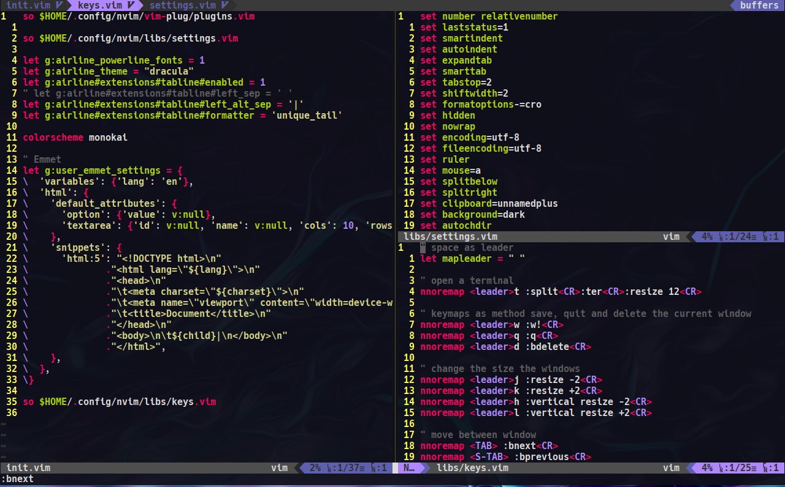
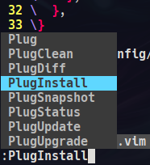

# nvim
Estas intrucciones te permitiran tener este repositorio funcionando en tu maquina local :)



## Comenzando
Instalar Neovim en tu distrucion linux
* Debian
```bash
sudo apt install neovim
```
* Arch
```bash
sudo pacman -S neovim
```

Luego clonar este repositorio, por defecto ya lo pone en la carpeta ~/.config
```bash
git clone https://github.com/denis360/nvim.git ~/.config/nvim
```

Luego ingresar con neovim al archivo init.vim
```bash
nvim ~/.config/nvim/init.vim
```

* Instalar los plugins



* Solo espera y con (Space + q) saldras de neovim

Puedes cambiar la configuracion de guardar, salir y quitar un archivo en la carpeta ./libs/keys.vim
```vim
nnoremap <leader>w :w!<CR> " Para guardar cambios
nnoremap <leader>q :q<CR> " Para salir de neovim
nnoremap <leader>d :bdelete<CR> " Para quitar de la vista el archivo actual
```
